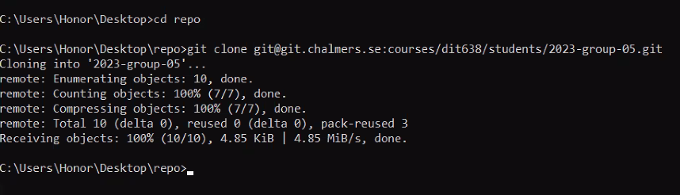

# 2023-group-05


## Getting Started
- First create a new folder
- Navigate to the folder you just created using "cd" and the folder name
- Copy the SSH link "git@git.chalmers.se:courses/dit638/students/2023-group-05.git" 
- Go back to the terminal and write "git clone" and paste the SSH link



## Tools You May Need
- Multipass
- Cmake
- Docker
- Any text editor

### Software Build and Docker Steps
To start build a program (we will use a helloworld program):
```
#include <iostream>
#include "PrimeChecker.hpp"

int main(int argc, char** argv) {
    if (argc == 2) {
        int number = std::stoi(argv[1]);
        PrimeChecker pc;
        std::cout << "last name, first name; " << number << " is a prime number? " << pc.isPrime(number) << std::endl;
    }
    return 0;
}
```
Next paste the following into a file named _CMakeLists.txt_ :
```
cmake_minimum_required(VERSION 3.2)
project(helloworld)
set(CMAKE_CXX_STANDARD 11)
add_executable(${PROJECT_NAME} ${CMAKE_CURRENT_SOURCE_DIR}/helloworld.cpp ${CMAKE_CURRENT_SOURCE_DIR}/PrimeChecker.cpp)
```

Then create two files as follows:

_PrimeChecker.hpp:_
```
#ifndef PRIMECHECKER
#define PRIMECHECKER
#include <cstdint>
class PrimeChecker {
   public:
    bool isPrime(uint16_t n);
};
#endif
```
_PrimeChecker.cpp:_
```
#include "PrimeChecker.hpp"

bool PrimeChecker::isPrime(uint16_t n) {
    bool retVal{true};
    if (n<2 || 0 == n%2) {
        retVal = false;
    }
    else {
        for(uint16_t i{3}; (i*i) <= n; i += 2) {
            if (0 == n%i) {
                return false;
                break;
            }
        }
    }
    return retVal;
}
```
Run the following commands:
```
docker run --rm -ti -v $PWD:/opt/sources ubuntu:22.04 /bin/bash
```

```
apt-get update
apt-get install build-essential cmake
```

Then create the build folder:
```
mkdir build
cd build
cmake ..
make
make test
```

Then create a Dockerfile and add this into the file:
```
##################################################
 Section 1: Build the application
FROM ubuntu:22.04 as builder
MAINTAINER Christian Berger christian.berger@gu.se

RUN apt-get update -y && \
    apt-get upgrade -y && \
    apt-get dist-upgrade -y

RUN apt-get install -y --no-install-recommends \
        cmake \
        build-essential

ADD . /opt/sources
WORKDIR /opt/sources

RUN cd /opt/sources && \
    mkdir build && \
    cd build && \
    cmake -D CMAKE_BUILD_TYPE=Release .. && \
    make && make test && cp helloworld /tmp

##################################################
 Section 2: Bundle the application.
FROM ubuntu:22.04
MAINTAINER Christian Berger christian.berger@gu.se

RUN apt-get update -y && \
    apt-get upgrade -y && \
    apt-get dist-upgrade -y

WORKDIR /opt
COPY --from=builder /tmp/helloworld .
ENTRYPOINT ["/opt/helloworld"]
```
Finally build the Dockerfile by doing the following (be sure to change the "CID/example:latest" to your desired name for the docker image):

```
docker build -t CID/example:latest -f Dockerfile .
```

To test run the docker:
```
docker run --rm CID/example:latest 42
```
Expected output:
```
lastname, firstname;42 is a prime? 0
```


## Team Collaboration

### Adding new features
The team will have weekly discussions on what needs to be done. As features arise they will be broken down into smaller tasks and added to our Trello board and as Gitlab issues. Finally, team members will be assigned to these tasks. 
The team should not push directly into the main branch, instead for each feature there will be a branch to push into. 


### Unexpected behaviour
For issues/tasks that contain bugs, we will create new Gitlab issues and new Trello board tasks. 


### Code review 
The code will not be reviewed by the members that wrote it. When writing code review messages, we will not address them directly but instead address the code. The feedback will be from the reviewers' point of view. 


### Commit structure
The commit message will be structured by referencing the issue number at the beginning of the message. Followed by a small description of the commit, using small case letters using present tense. 


## Developers

- Shahd Metwally
- Elias Samantzis 
- Anasha Aushi Sarker
- Dimitrios Pokkias
- Sepehr Moradian